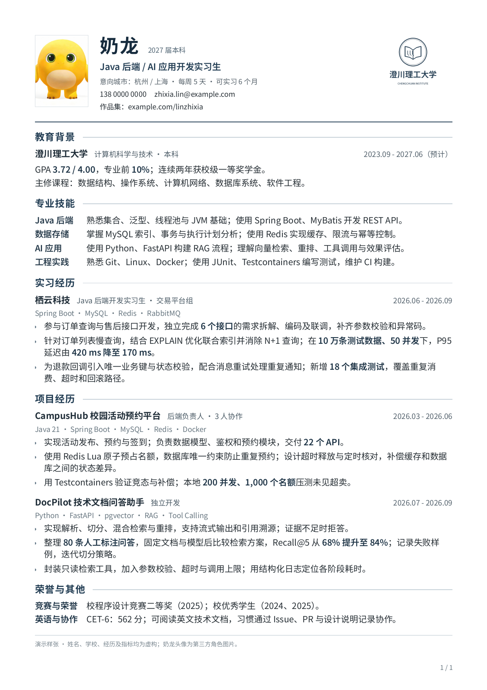

# tech-resume-kit

用 Markdown 写中文技术简历，用独立 YAML 调整版式，在本地预览和导出 PDF。

[](https://github.com/MoChiUaena/tech-resume-kit/actions/workflows/verify.yml)



[校招样张 PDF](output/pdf/campus-ink-blue.pdf) · [AI 实习样张 PDF](output/pdf/ai-intern-ink-blue.pdf) · [两页经验样张 PDF](output/pdf/experienced-ink-blue.pdf) · [可直接填写的 resume.md](resume.md) · [版式配置](layout.yaml)

**首个公开版本 v0.3.0。** 一个墨蓝主风格，提供校招与工作经验编排；支持一页/两页 PDF、独立图片配置、模块排序，以及实际 PDF 的本地自动刷新预览。长标题、长链接、内容增减、长项目续页和照片方向已通过专项验证。

样例的人物、院校、公司、经历和全部指标均为虚构；校徽为自制虚构标识，照片为许可来源明确的 AI 合成人像。不代表真实候选人或任何公司的官方模板。

## 三步开始

需要 Node.js 22 或更高版本。首次安装需要联网下载 npm 依赖和 Chromium；准备好后预览和导出可断网运行。

```sh
git clone https://github.com/MoChiUaena/tech-resume-kit.git
cd tech-resume-kit
npm ci
npx playwright install chromium
npm run init -- --dir personal/my-resume
```

Linux 可能需要用 `npx playwright install --with-deps chromium` 安装系统依赖。

编辑生成目录内的 `resume.md` 和 `layout.yaml`，然后运行：

```sh
npm run check -- personal/my-resume/resume.md
npm run preview -- personal/my-resume/resume.md
npm run build -- personal/my-resume/resume.md --out personal/my-resume/output/resume.pdf
```

预览默认是 `http://127.0.0.1:4173`，仅本机可访问，内嵌显示实际生成的 PDF；可以查看真实分页、缩放和翻页。保存 Markdown、配置或启用的图片后自动刷新。输入错误或超页时显示错误，修正后恢复，不继续展示旧 PDF。用 `--port 4174` 更换端口，用 Ctrl+C 停止；若浏览器不显示内嵌 PDF，可点击“打开 PDF”。

PDF 导出使用同一份 HTML/CSS，等待字体和图片加载完成。check、preview 和 build 都以实际 PDF 页数执行上限检查。输出已存在时会停止；确认要更新才加 `--force`。校验失败或超过页数上限时，原 PDF 保持不变。直接查看或保存已生成的 PDF 即可，不需要再次打印 HTML。

`personal/`、`private/` 和 `*.local.*` 默认被 Git 忽略；起步目录不会覆盖现有目录。没有上传、远程图片、在线字体或第三方 PDF 服务。

## Markdown 怎么写

顶部 YAML 写姓名、目标岗位、联系方式和相对图片引用；正文写经历。下面是一个条目：

````markdown
## 项目经历 {#projects .entries}

### 我的项目

```yaml
subtitle: 后端负责人 · 3 人协作
date: "2026.03 - 2026.06"
stack: Java 21 · Spring Boot · MySQL
```

- 说明负责的模块、关键技术做法和可核实的结果。
- 支持 **加粗**、`技术名词` 和 [项目链接](https://example.com/project)。
````

`{#projects .entries}` 指定章节 ID 和内容类型；ID 用于排序，修改中文标题不会破坏配置。日期与角色通过字段表达，不用空格对齐。段落与列表按源文件顺序保留。

支持 `entries`（教育/实习/项目条目）、`skills`（技能组）、`lines`（普通段落与单层列表）三种章节。完整规则、错误示例和字段说明见 [输入格式](docs/input-format.md)。不支持原始 HTML、内嵌 Markdown 图片、嵌套列表、表格或引用式链接定义。

## 调整版式

`layout.yaml` 和正文分开；省略的字段使用主风格默认值。配置默认读取 Markdown 同目录的 `layout.yaml`，也可用 `--config` 指定其他文件。

```yaml
schemaVersion: 0.2.0
preset: campus
bodyPt: 10.5
lineHeight: 1.36
page:
  marginMm: 15
images:
  portrait:
    enabled: true
    slot: start
    widthMm: 23
    heightMm: 31
  schoolLogo:
    enabled: true
    slot: end
    widthMm: 34
    heightMm: 25
```

Logo 默认位于右上角，以 `contain` 保留透明背景；照片默认在左侧，以 `cover` 裁切。两张图各自开关，关闭后收回占位。`slot` 可选 `start` / `end`，`align` 可选 `top` / `center` / `bottom`，`header.gapMm` 控制间距。图片格式支持本地 PNG/JPEG，路径相对 **Markdown 所在目录**。

`preset: campus` 按教育、技能、实习/工作、项目、其他排列；`preset: experience` 按技能、工作/实习、项目、教育、其他排列。它们共享同一主风格。显式 `sectionOrder: [skills, projects, ...]` 优先于 preset，必须包含全部章节 ID，不允许丢字段或重复。自定义 ID 在预设中的常见模块之后，按源文件顺序追加。

可调范围：正文 10.5-11 pt，姓名 20-24 pt，页边距 14-17 mm，行高 1.25-1.5；颜色用六位十六进制值；模块间距 `spacing.sectionMm` 为 3-5 mm，条目间距 `spacing.entryMm` 为 2-5 mm。字体不自动缩小。

默认 `page.maxPages: 1`，旧配置行为保持不变。允许两页时设置：

```yaml
page:
  maxPages: 2
```

这是页数上限，内容少时仍生成一页。章节标题跟随下一条内容；项目和普通段落允许续页，正文保持字号和顺序。第二页带续页标识，每页有页码。稍微超过一页时会提示末页可能偏空，建议在实际预览中判断是否精简内容或缩短链接显示文字；该提示是基于内容高度的估计，不会自动改写内容。

## 示例与命令

| 输入 | 用途 |
| --- | --- |
| `resume.md` + `layout.yaml` | 完整 Java 校招样例，学校 Logo 与照片同时显示 |
| `examples/ai-intern/resume.md` | 完整 AI 实习样例，无图片、11 pt 正文、不同模块顺序与正文链接 |
| `examples/experienced/resume.md` | 两页工作经验样例，5 年后端经验、长项目续页 |
| `templates/blank/resume.md` | 带填写提示的空白起步文件 |

```sh
# 从空白提示开始
npm run init -- --dir personal/new-resume --template blank

# 从两页工作经验示例开始
npm run init -- --dir personal/work-resume --template experience

# 不指定输入时使用根目录 resume.md
npm run check
npm run build -- --out personal/output/resume.pdf

# 构建第二份匿名样例
npm run build -- examples/ai-intern/resume.md --out personal/output/ai.pdf

# 维护者命令：明确更新 output/pdf/ 内三份公开匿名样张和核验输入
npm run sample
```

通用 build 默认仅输出 PDF，不额外落盘你的结构化资料。未指定 `--out` 时写入当前工作目录的 `personal/output/resume.pdf`。`npm run sample` 专门重建仓库匿名样例，会更新固定样张路径。其独立 HTML 是内嵌字体和图片的排版中间产物，文件较大且已被忽略；多页效果以 preview 或 PDF 为准。

## 验证与实现

```sh
npm test
python -m pip install pypdf pdfplumber
python -X utf8 scripts/verify-pdf.py

# 另需安装 Poppler；渲染所有页面，不遗漏第二页
python scripts/render-pdfs.py

# 构建并核验边界内容；产物在 Git 忽略的 tmp/pdfs/boundary 中
npm run qa:boundaries
python -X utf8 scripts/verify-pdf.py --directory tmp/pdfs/boundary
python scripts/render-pdfs.py --directory tmp/pdfs/boundary --dpi 110
```

三份正式样张共 4 页，分别核对 49 / 46 / 71 个文本字段；9 份边界 PDF 共 13 页，另有超出两页和超长页眉两类拒绝用例。全部有效页面已渲染并逐页检查。验证覆盖嵌入字体、正文阅读顺序、链接、图像、纸张边界和标题跟随，记录见 [阶段 C 核验](docs/phase-c-review.md)。14 项自动测试覆盖解析、复制到外部目录、预览刷新及覆盖保护，不宣称所有 ATS 都能正确解析。

数据链路为 `Markdown/YAML → ResumeDocument + LayoutConfig → HTML/CSS → Chromium PDF`。模型版本为 `0.2.0`；解析器与渲染器独立，工作台可直接生成相同结构，见 [模型与接口](docs/content-model.md)。阶段 A 的 JSON 留作回归基准，不再是默认编辑入口。

## 许可与后续

代码、CSS、样例文字和虚构校徽采用 [MIT](LICENSE)。Noto Sans SC 衍生字体按 [SIL OFL 1.1](assets/fonts/OFL.txt) 分发，人像保留来源公共领域标记，详情见 [素材说明](assets/README.md)。新增依赖按各自的 MIT / ISC / Apache-2.0 许可分发，版本固定在锁文件中。

仓库的 CI 只读取三份匿名样例及合成边界内容，依次运行测试、PDF 文字核验与逐页渲染；源文件审计会拒绝将 `personal/`、`private/` 或意外生成的 PDF 加入 Git。运行时依赖由 `package-lock.json` 固定，可选 PDF 复核工具由 `requirements-qa.txt` 固定。当前以 GitHub 源码和 Release 提供下载，未发布 npm 包。工作台接入字段与调用方式见 [交接说明](docs/workbench-handoff.md)；没有修改工作台项目或部署个人简历网页。
