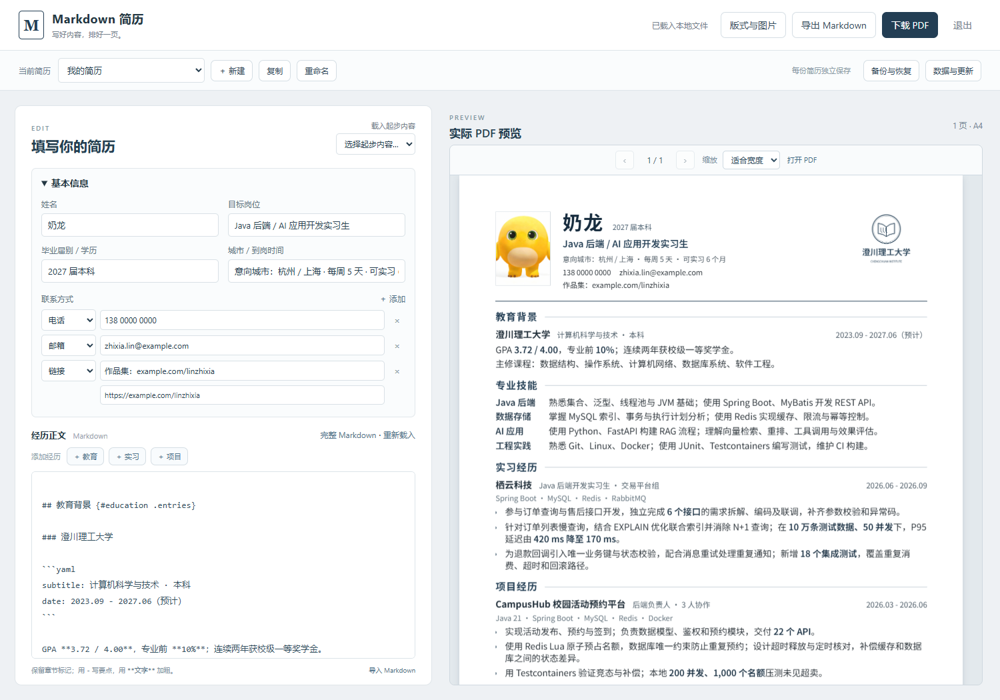

# tech-resume-kit

在本地页面填写中文技术简历，用 Markdown 编辑经历，实时预览并下载 PDF。Windows / macOS / Linux 启动包随包提供运行组件。

[](https://github.com/MoChiUaena/tech-resume-kit/actions/workflows/verify.yml)



[校招样张 PDF](output/pdf/campus-ink-blue.pdf) · [AI 实习样张 PDF](output/pdf/ai-intern-ink-blue.pdf) · [两页经验样张 PDF](output/pdf/experienced-ink-blue.pdf) · [可直接填写的 resume.md](resume.md) · [版式配置](layout.yaml)

**公开版本 v0.11.0。** 一个墨蓝主风格，提供校招与工作经验编排；支持照片裁剪、经历管理、章节排序与改名、草稿保护与恢复、多份简历、回收站、整库 ZIP、数据目录迁移，以及可翻页和缩放的离线 PDF 预览。

校招样张使用“奶龙”姓名和白底竖版头像。图片来源与许可信息集中记录在[素材说明](assets/README.md)。

## 下载使用

[下载 Windows 免安装包](https://github.com/MoChiUaena/tech-resume-kit/releases/download/v0.11.0/tech-resume-windows-x64-0.11.0.zip) · Windows 10 / 11 x64

| 其他系统 | 下载 | 启动入口 |
| --- | --- | --- |
| macOS Apple Silicon | [arm64 包](https://github.com/MoChiUaena/tech-resume-kit/releases/download/v0.11.0/tech-resume-macos-app-arm64-0.11.0.zip) | 双击 TechResumeKit.app |
| macOS Intel | [x64 包](https://github.com/MoChiUaena/tech-resume-kit/releases/download/v0.11.0/tech-resume-macos-app-x64-0.11.0.zip) | 双击 TechResumeKit.app |
| Linux x64 | [x64 包](https://github.com/MoChiUaena/tech-resume-kit/releases/download/v0.11.0/tech-resume-linux-x64-0.11.0.tar.gz) | ./启动简历.sh |
| Linux ARM64 | [arm64 包](https://github.com/MoChiUaena/tech-resume-kit/releases/download/v0.11.0/tech-resume-linux-arm64-0.11.0.tar.gz) | ./启动简历.sh |

macOS 打开方式与 Linux 系统依赖见[跨平台使用说明](docs/portable.md)。

1. 完整解压，运行对应系统的启动入口；Windows 双击 **启动简历.exe**。
2. 在打开的页面填写基本信息和 Markdown 经历，右侧自动更新实际 PDF 预览。
3. 点击 **下载 PDF**。

照片、校徽和版式通过“版式与图片”设置，照片可裁剪为 23:31；章节可在同一界面调整顺序与名称。正文上方可用表单添加教育、实习和项目经历，“管理已有经历”支持编辑、复制、上下移动和删除。修改自动保存，重启后可以继续编辑。

保存失败时，页面保留输入并显示原因，可重试或下载包含图片的未保存草稿 ZIP。主编辑区的修改会按简历和窗口独立暂存，刷新或重新打开程序后可选择恢复到编辑区；恢复后仍检查正式文件冲突。弹窗中尚未提交到编辑区的内容不在自动草稿范围内。

首次打开提供空白、奶龙校招和两页经验起步选择，也可直接填写。填写导航可展开基本信息、经历、技能与补充区域，并打开版式设置；已有资料从模板新建独立简历。引导关闭或开始填写后，重启不再重复显示。另支持工作经历表单、“技能与补充信息”中的技能编辑与排序、补充章节填写。普通文字即可填写常用内容；原 Markdown、加粗、链接和段落顺序继续保留。超出一页时，预览区可直接选择“允许两页继续预览”，或打开版式设置。

“当前简历”支持新建、复制、重命名和切换，每份简历有独立正文、版式、图片与历史。“备份与恢复”可以立即备份、下载包含图片的完整 ZIP，以及恢复历史版本或备份文件；恢复前先保留当前内容。有修改时每 5 分钟生成自动版本，切换或退出前也会保存。

数据默认保存到 `%LOCALAPPDATA%\TechResumeKit\data`，与程序分开。“数据与更新”显示实际位置，可迁移全部资料或打开已有简历库。从 v0.6.0 升级时会识别旧版 `my-resume`，迁移前保存整库副本并核对文件，原目录保留。单份备份 ZIP 对应当前简历。“简历库管理”提供回收站与整库 ZIP；整库包含全部简历、图片、历史和当前选择，恢复前保留可下载的原库副本。

“检查正式版本”可以下载并核验新版安装包，支持暂停、断线续传和重启后继续。点击“保存并打开新版”才切换程序，切换前会保存整库副本，启动失败时尝试返回原程序。

运行所需资源随包提供，解压后可断网使用。[使用入口的参考与说明](docs/usability.md)记录了同类项目的流程比较。开发者可下载 [TGZ](https://github.com/MoChiUaena/tech-resume-kit/releases/download/v0.11.0/tech-resume-kit-0.11.0.tgz)，通过 ESM API 或 JSON 命令复用排版，见[调用接口](docs/api.md)。

## 从源码开始

需要 Node.js 22.13 或更高版本。首次安装需要联网下载 npm 依赖和 Chromium；准备好后预览和导出可断网运行。

```sh
git clone https://github.com/MoChiUaena/tech-resume-kit.git
cd tech-resume-kit
npm ci
npx playwright install chromium
npm run app
```

Linux 可能需要用 `npx playwright install --with-deps chromium` 安装系统依赖。

`npm run app` 打开同一套本地编辑页面，默认使用独立数据目录；Windows 为 `%LOCALAPPDATA%\TechResumeKit\data`。“数据与更新”显示实际路径，可迁移整库或打开已有简历库。指定位置可用 `npm run app -- --dir personal/my-resume`。macOS 默认保存在 `~/Library/Application Support/TechResumeKit/data`，Linux 为 `~/.local/share/TechResumeKit/data`（支持 `XDG_DATA_HOME`）。

完整变更见[变更记录](docs/changelog.md)，数据位置与更新方式见[数据与更新](docs/data-and-updates.md)。日常改动先同步源码和 CI，积累一组功能后集中发布，见[维护说明](docs/maintaining.md)。

自 v0.9.0 起提供工作台模型 2、3、4 的显式转换 API 与 JSON 命令，返回章节映射和版式差异报告，见[工作台接入](docs/workbench-handoff.md)。接口与示例随正式 TGZ 提供。

macOS 原生 `.app` 随正式下载提供运行组件，使用方式见[macOS 应用包](docs/macos-app.md)。

如需使用命令行，先创建独立起步目录：

```sh
npm run init -- --dir personal/my-resume --template blank
```

编辑生成目录内的 `resume.md` 和 `layout.yaml`，然后运行：

```sh
npm run check -- personal/my-resume/resume.md
npm run preview -- personal/my-resume/resume.md
npm run build -- personal/my-resume/resume.md --out personal/my-resume/output/resume.pdf
```

预览默认是 `http://127.0.0.1:4173`，仅本机可访问。离线预览器显示实际生成的 PDF，支持翻页、缩放、文本选择和链接，字体与图片从 PDF 中读取。保存 Markdown、配置或启用的图片后自动刷新。输入错误或超页时显示错误，修正后恢复。用 `--port 4174` 更换端口，用 Ctrl+C 停止；“打开 PDF”可以在新窗口查看原文件。

PDF 导出使用同一份 HTML/CSS，等待字体和图片加载完成。check、preview 和 build 都以实际 PDF 页数执行上限检查。输出已存在时会停止；确认要更新才加 `--force`。校验失败或超过页数上限时，原 PDF 保持不变。直接查看或保存已生成的 PDF 即可，不需要再次打印 HTML。

`my-resume/`、`personal/`、`private/` 和 `*.local.*` 默认被 Git 忽略；起步目录不会覆盖现有目录。内容和图片在本机存取，中文字体随包提供。

## Markdown 怎么写

顶部 YAML 写姓名、目标岗位、联系方式和相对图片引用；正文写经历。下面是一个条目：

````markdown
## 项目经历 {#projects .entries}

### 我的项目

```yaml
subtitle: 后端负责人 · 3 人协作
date: "2026.03 - 2026.06"
stack: Java 21 · Spring Boot · MySQL
```

- 说明负责的模块、关键技术做法和可核实的结果。
- 支持 **加粗**、`技术名词` 和 [项目链接](https://example.com/project)。
````

`{#projects .entries}` 指定章节 ID 和内容类型；ID 用于排序，修改中文标题不会破坏配置。日期与角色通过字段表达，不用空格对齐。段落与列表按源文件顺序保留。

支持 `entries`（教育/实习/项目条目）、`skills`（技能组）、`lines`（普通段落与单层列表）三种章节。完整规则、错误示例和字段说明见 [输入格式](docs/input-format.md)。不支持原始 HTML、内嵌 Markdown 图片、嵌套列表、表格或引用式链接定义。

## 调整版式

`layout.yaml` 和正文分开；省略的字段使用主风格默认值。配置默认读取 Markdown 同目录的 `layout.yaml`，也可用 `--config` 指定其他文件。

```yaml
schemaVersion: 0.2.0
preset: campus
bodyPt: 10.5
lineHeight: 1.36
page:
  marginMm: 15
images:
  portrait:
    enabled: true
    slot: start
    widthMm: 23
    heightMm: 31
  schoolLogo:
    enabled: true
    slot: end
    widthMm: 34
    heightMm: 25
```

Logo 默认位于右上角，以 `contain` 保留透明背景；照片默认在左侧，以 `cover` 裁切。两张图各自开关，关闭后收回占位。`slot` 可选 `start` / `end`，`align` 可选 `top` / `center` / `bottom`，`header.gapMm` 控制间距。图片格式支持本地 PNG/JPEG，路径相对 **Markdown 所在目录**。

`preset: campus` 按教育、技能、实习/工作、项目、其他排列；`preset: experience` 按技能、工作/实习、项目、教育、其他排列。它们共享同一主风格。显式 `sectionOrder: [skills, projects, ...]` 优先于 preset，必须包含全部章节 ID，不允许丢字段或重复。自定义 ID 在预设中的常见模块之后，按源文件顺序追加。

可调范围：正文 10.5-11 pt，姓名 20-24 pt，页边距 14-17 mm，行高 1.25-1.5；颜色用六位十六进制值；模块间距 `spacing.sectionMm` 为 3-5 mm，条目间距 `spacing.entryMm` 为 2-5 mm。字体不自动缩小。

默认 `page.maxPages: 1`，旧配置行为保持不变。允许两页时设置：

```yaml
page:
  maxPages: 2
```

这是页数上限，内容少时仍生成一页。章节标题跟随下一条内容；项目和普通段落允许续页，正文保持字号和顺序。第二页带续页标识，每页有页码。稍微超过一页时会提示末页可能偏空，建议在实际预览中判断是否精简内容或缩短链接显示文字；该提示是基于内容高度的估计，不会自动改写内容。

## 示例与命令

| 输入 | 用途 |
| --- | --- |
| `resume.md` + `layout.yaml` | 完整 Java 校招样例，学校 Logo 与照片同时显示 |
| `examples/ai-intern/resume.md` | 完整 AI 实习样例，无图片、11 pt 正文、不同模块顺序与正文链接 |
| `examples/experienced/resume.md` | 两页工作经验样例，5 年后端经验、长项目续页 |
| `templates/blank/resume.md` | 带填写提示的空白起步文件 |

```sh
# 从空白提示开始
npm run init -- --dir personal/new-resume --template blank

# 从两页工作经验示例开始
npm run init -- --dir personal/work-resume --template experience

# 不指定输入时使用根目录 resume.md
npm run check
npm run build -- --out personal/output/resume.pdf

# 构建第二份匿名样例
npm run build -- examples/ai-intern/resume.md --out personal/output/ai.pdf

# 维护者命令：明确更新 output/pdf/ 内三份公开匿名样张和核验输入
npm run sample
```

通用 build 默认仅输出 PDF，不额外落盘你的结构化资料。未指定 `--out` 时写入当前工作目录的 `personal/output/resume.pdf`。`npm run sample` 专门重建仓库匿名样例，会更新固定样张路径。其独立 HTML 是内嵌字体和图片的排版中间产物，文件较大且已被忽略；多页效果以 preview 或 PDF 为准。

## 验证与实现

```sh
npm test
python -m pip install pypdf pdfplumber
python -X utf8 scripts/verify-pdf.py

# 另需安装 Poppler；渲染所有页面，不遗漏第二页
python scripts/render-pdfs.py

# 构建并核验边界内容；产物在 Git 忽略的 tmp/pdfs/boundary 中
npm run qa:boundaries
python -X utf8 scripts/verify-pdf.py --directory tmp/pdfs/boundary
python scripts/render-pdfs.py --directory tmp/pdfs/boundary --dpi 110
```

三份正式样张共 4 页，分别核对 49 / 46 / 71 个文本字段；9 份边界 PDF 共 13 页，另有超出两页和超长页眉两类拒绝用例。全部有效页面已渲染并逐页检查。验证覆盖嵌入字体、正文阅读顺序、链接、图像、纸张边界和标题跟随，记录见 [阶段 C 核验](docs/phase-c-review.md)。26 项自动测试覆盖解析、复制到外部目录、预览刷新及覆盖保护，不宣称所有 ATS 都能正确解析。

数据链路为 `Markdown/YAML → ResumeDocument + LayoutConfig → HTML/CSS → Chromium PDF`。模型版本为 `0.2.0`；解析器与渲染器独立，工作台可直接生成相同结构，见 [模型与接口](docs/content-model.md)。阶段 A 的 JSON 留作回归基准，不再是默认编辑入口。

## 许可与后续

代码、样例文字和虚构校徽采用 [MIT](LICENSE)，中文字体按 [SIL OFL 1.1](assets/fonts/OFL.txt) 分发。图片的来源和使用说明见[素材说明](assets/README.md)。

仓库 CI 使用公开样例、空白起步文件及合成边界内容，验证独立安装、导出、PDF 文字与逐页渲染。运行时依赖由 `package-lock.json` 固定，可选 PDF 复核工具由 `requirements-qa.txt` 固定。当前通过 GitHub 源码和 Release 提供 Windows 免安装包、源码 ZIP / TGZ 下载，未发布到 npm 注册表。工作台接入见[交接说明](docs/workbench-handoff.md)。
