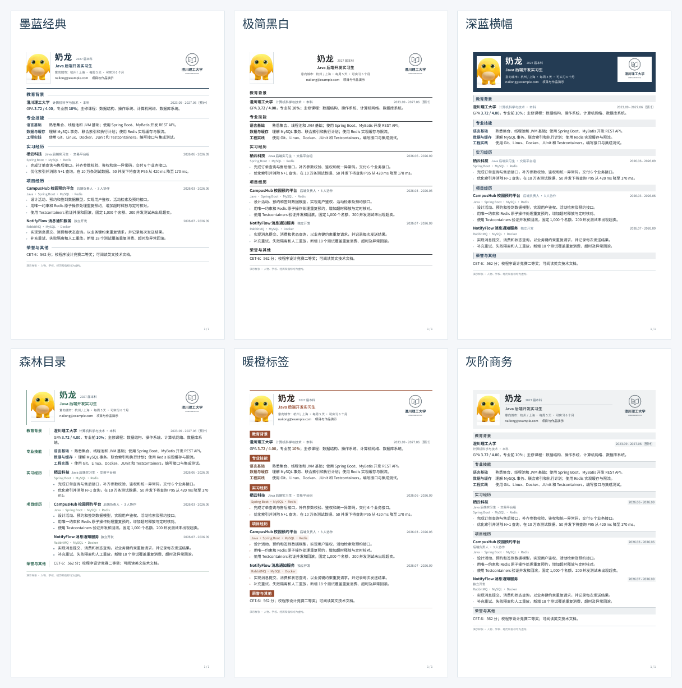

# tech-resume-kit

本地优先的中文技术简历工具。用表单填写，或直接编辑 Markdown；在网页中查看实际 PDF，选择版式后离线导出。简历文字、照片和校徽保存在自己的电脑上，无需账号。

[](https://github.com/MoChiUaena/tech-resume-kit/actions/workflows/verify.yml) · [下载最新版](https://github.com/MoChiUaena/tech-resume-kit/releases/latest) · [MIT 许可](LICENSE)


## 快速开始

当前正式版为 **v0.12.0**。下载对应系统的启动包，完整解压后启动程序；运行组件已包含在包内，无需单独安装 Node.js。

| 系统 | 下载 | 启动 |
| --- | --- | --- |
| Windows 10/11 x64 | [免安装 ZIP](https://github.com/MoChiUaena/tech-resume-kit/releases/download/v0.12.0/tech-resume-windows-x64-0.12.0.zip) | 双击 `启动简历.exe` |
| macOS Apple Silicon | [应用 ZIP](https://github.com/MoChiUaena/tech-resume-kit/releases/download/v0.12.0/tech-resume-macos-app-arm64-0.12.0.zip) | 打开 `TechResumeKit.app` |
| macOS Intel | [应用 ZIP](https://github.com/MoChiUaena/tech-resume-kit/releases/download/v0.12.0/tech-resume-macos-app-x64-0.12.0.zip) | 打开 `TechResumeKit.app` |
| Linux x64 | [运行包](https://github.com/MoChiUaena/tech-resume-kit/releases/download/v0.12.0/tech-resume-linux-x64-0.12.0.tar.gz) | 运行 `./启动简历.sh` |
| Linux ARM64 | [运行包](https://github.com/MoChiUaena/tech-resume-kit/releases/download/v0.12.0/tech-resume-linux-arm64-0.12.0.tar.gz) | 运行 `./启动简历.sh` |

打开页面后选择空白模板或样张，填写基本信息、经历和技能，确认右侧预览，再点击 **下载 PDF**。macOS 首次打开及 Linux 系统依赖见[跨平台说明](docs/portable.md)。

> `main` 包含正式版之后的排版改进，包括内置宋体、图标页眉和“试用紧凑单页”；这些改动尚未进入 v0.12.0 启动包。想体验当前源码请看下方[从源码运行](#从源码运行)。

## 功能

- **表单优先，Markdown 可选**：按教育、实习、工作和项目填写；需要精细控制时展开高级编辑。
- **六套外观、十种起步内容**：外观与内容自由组合，切换风格保留正文和图片。
- **实际 PDF 预览**：可翻页、缩放、选择文字并检查链接；照片按 23:31 裁剪，校徽独立放置。
- **本地资料管理**：自动保存、多份简历、未保存草稿恢复、历史版本、回收站及单份或整库 ZIP 备份。
- **可控排版**：调整字体、字号、行距、边距、章节顺序和图片尺寸；超页时提示，不暗中删字或缩小字号。

## 看看模板



起步内容包括空白、奶龙校招、两页工作经验，以及前端、Java/Python 后端、AI 应用、数据分析、测试开发和 Android 样张。可先查看[校招 PDF](output/pdf/campus-ink-blue.pdf)、[AI 实习 PDF](output/pdf/ai-intern-ink-blue.pdf)和[两页经验 PDF](output/pdf/experienced-ink-blue.pdf)。样张文字和图片仅用于演示，请替换成自己的资料。

## 数据保存在哪里

| 系统 | 默认数据目录 |
| --- | --- |
| Windows | `%LOCALAPPDATA%\TechResumeKit\data` |
| macOS | `~/Library/Application Support/TechResumeKit/data` |
| Linux | `~/.local/share/TechResumeKit/data`（支持 `XDG_DATA_HOME`） |

程序目录与数据目录分开；页面“数据与更新”可查看实际位置并迁移资料。编辑和 PDF 导出可断网使用；更新检查只读取正式 Release。请定期在“备份与恢复”下载 ZIP，迁移全部简历时使用“简历库管理”的整库 ZIP。详见[数据与更新](docs/data-and-updates.md)。

## 从源码运行

需要 Node.js **22.13+**。首次安装 npm 依赖与 Chromium 需要联网，准备好后编辑和导出可断网运行。

```sh
git clone https://github.com/MoChiUaena/tech-resume-kit.git
cd tech-resume-kit
npm ci
npx playwright install chromium
npm run app
```

Linux 可能还需 `npx playwright install --with-deps chromium`。源码版也默认使用平台数据目录；用 `npm run app -- --dir personal/my-resume` 可指定独立目录。`personal/`、`private/` 和 `*.local.*` 已被 Git 忽略。

## Markdown、命令行与接口

网页中可导出 Markdown。也可以在独立目录维护 `resume.md` 与 `layout.yaml`，使用命令行校验和生成 PDF：

```sh
npm run init -- --dir personal/my-resume --template blank
npm run check -- personal/my-resume/resume.md
npm run build -- personal/my-resume/resume.md --out personal/my-resume/output/resume.pdf
```

输入语法见[Markdown 格式](docs/input-format.md)，版式与章节结构见[内容模型](docs/content-model.md)。开发者可通过 [ESM API / JSON 命令](docs/api.md)复用导出能力；工作台数据转换见[接入说明](docs/workbench-handoff.md)。项目未发布到 npm 注册表，正式版 [TGZ](https://github.com/MoChiUaena/tech-resume-kit/releases/download/v0.12.0/tech-resume-kit-0.12.0.tgz) 可直接下载。

## 参与开发

欢迎通过 [Issues](https://github.com/MoChiUaena/tech-resume-kit/issues) 报告可复现的问题或提出建议。提交改动前请阅读[贡献指南](CONTRIBUTING.md)；CI 会验证输入、编辑器、PDF、独立安装及各平台启动包。历史变更见[变更记录](docs/changelog.md)。

代码与匿名样例文字采用 [MIT](LICENSE)；随包字体分别遵循其 [OFL 许可](assets/README.md)，演示图片的来源与说明也列在[素材说明](assets/README.md)。