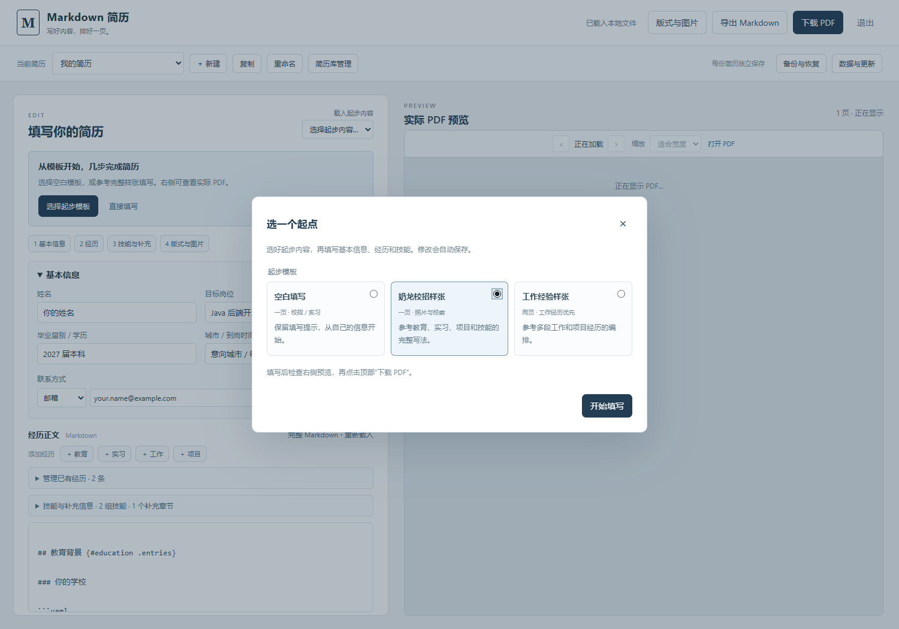

# 使用入口的参考与封装

2026-09-28 根据以下 GitHub 项目的 README 比较使用流程：

| 项目 | 使用方式 | 对本项目的启发 |
| --- | --- | --- |
| [Oh My CV](https://github.com/Renovamen/oh-my-cv) | 浏览器 Markdown 编辑、实时预览、PDF 导出、本地保存 | 将编辑、预览与下载放在同一个页面 |
| [mdnice/markdown-resume](https://github.com/mdnice/markdown-resume) | 在线 Markdown 排版与 PDF 导出 | 把日常版式调整变成界面操作 |
| [junian/markdown-resume](https://github.com/junian/markdown-resume) | 本地优先编辑、图片管理、导入导出 | 保留本地资料与源 Markdown |
| [CyC2018/Markdown-Resume](https://github.com/CyC2018/Markdown-Resume) | 修改 Markdown、配置 Typora 主题、导出 HTML 后打印 | 编辑器与导出工具的安装步骤仍有门槛 |
| [markdown-resume-js](https://github.com/c0bra/markdown-resume-js) | npm 命令、wkhtmltopdf、另设自动刷新 | 保留 CLI 给开发者，普通用户用封装入口 |

v0.5.0 提供 Windows 10 / 11 x64 免安装 ZIP，包含启动程序、Node.js、锁定的 Chromium、依赖和字体。用户完整解压后双击启动，在本地页面填写基本信息、编辑 Markdown、设置图片和下载实际 PDF。

页面与启动程序为本项目实现；参考使用流程，未复制其他项目的代码或 CSS。导出继续使用既有 HTML/CSS 与 Chromium 路径，Markdown、模型和 API 保持兼容。Windows 包的构建和独立启动验证见 `npm run package:windows` 与 `npm run test:windows`。

## 表单填写

自 v0.9.0 起，基本信息、教育、实习、工作、项目、技能和补充信息均有表单入口。技能可填写分组名称与说明，支持复制、排序和删除；补充信息可写普通段落，也保留已有列表、加粗和链接。更复杂的内容仍可使用原 Markdown 编辑区。

修改继续保存到每份简历的 `resume.md` 与 `layout.yaml`，沿用独立图片和历史。删除前自动保留完整备份，旧窗口或外部修改会触发冲突提示。更新程序不会把简历资料放入应用包。

v0.10.0 的 PDF 与 Markdown 导出文件名包含当前简历名称，同一姓名的多个版本下载后仍能区分。

v0.10.0 切换联系方式类型时，会保留原显示文字，但不把“作品集”等文字误当作邮箱或电话号码。未填完的目标地址作为本地草稿保留；补全后右侧 PDF 恢复预览和下载。

超页提示提供“允许两页继续预览”和“调整版式”按钮；选择两页才更新页数上限，正文不自动缩小。预览与下载继续使用同一份实际 PDF。

v0.10.0 可在“版式与图片”中用箭头调整章节顺序，单独保存到当前简历的版式；“恢复预设顺序”或切换信息编排预设会恢复对应默认顺序，正文保持不变。

同一列表也可修改教育、实习、项目、技能等章节的显示名称，不必手动编辑 Markdown 的章节标记。

也可在“技能与补充信息”中修改已有补充章节的名称，原有内容和章节排序保留。

## 第一次填写

v0.9.0新建数据目录时，页面显示“选择起步模板”和“直接填写”。起步选择提供三份内容：空白填写模板、一页奶龙校招样张、两页工作经验样张。选择后定位到姓名，随后可通过填写导航打开已有经历、技能与补充信息、版式与图片。检查右侧实际 PDF 后点击“下载 PDF”。

引导不阻挡直接编辑。关闭或开始填写后重启不再重复显示；已有和迁入的简历直接进入编辑器。“起步模板”仍可新建独立简历，名称与模板可选择，原资料保留。修改中的资料、旧窗口或外部编辑不会被起步选择覆盖。

